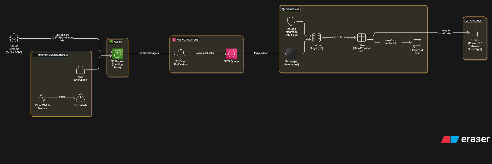

# **❄️ Real-Time Data Ingestion into Snowflake (S3 → Snowpipe → SQS Auto-Ingest)**

This project demonstrates a **real-time ingestion pipeline** where data uploaded to **Amazon S3** is automatically loaded into **Snowflake** using **Snowpipe**, **SQS event notifications**, and **Storage Integration**.

This setup is identical to how modern data engineering teams handle streaming-like ingestion without maintaining servers.

---

## **🚀 What This Pipeline Does (Simple Explanation)**

1. Upload a CSV file into an **S3 bucket**
2. **S3 → SQS event notification** fires instantly
3. **Snowpipe** receives the file notification
4. Snowpipe copies the file **automatically** into Snowflake
5. Data becomes query-ready within seconds

No servers. No cron jobs. Just continuous, event-driven ingestion.

---

## **🎯 Why I Built It**

To master the skills that real Snowflake data engineers use:

* Creating S3 buckets for staging
* Setting up **Snowflake Storage Integrations**
* Using **Snowpipe** for serverless auto-ingestion
* Configuring **SQS → Snowflake** notifications
* Using **file formats, stages, pipes, and warehouses**
* Running SQL-based ETL workflows

This project shows end-to-end cloud + Snowflake integration.

---

## **🏗️ Architecture**



**Flow:**
S3 (CSV files) → SQS Event → Snowpipe → Table (Snowflake)

---

## **📁 Repository Structure**

```
Realtime-Data-Ingestion-using-Snowflake/
│
├── S3_Snowflake_Auto Ingestion.sql       # Full SQL script for storage integration + pipe
├── Marketing_conversion_data.csv         # Sample input file
├── Marketing_conversion_data11.csv       # Sample input file
├── snowflake.png                         # Snowflake logo/image
├── snowflakeproject_architecture.png      # Architecture diagram
└── README.md
```

---

# **🛠️ Tech Stack**

### **☁️ AWS**

* S3 (file storage)
* SQS (event notifications)
* IAM (access roles)

### **❄️ Snowflake**

* Storage Integration
* File Format (CSV)
* External Stage
* Snowpipe (Auto-Ingest = TRUE)
* SQL copy commands

### **🔗 Services Communication**

* S3 → SQS → Snowpipe triggers

---

# **⚙️ Step-by-Step Implementation (How I Built It)**

---

## **1️⃣ Create S3 Bucket**

Purpose:

* Bucket stores raw CSV files.
* Snowpipe listens for any new uploads.

Example:

```
s3://my-snowflake-ingestion-bucket/data/
```

---

## **2️⃣ Create Snowflake Storage Integration**

Go to Snowflake → Worksheet → run:

```sql
CREATE STORAGE INTEGRATION my_integration
TYPE = EXTERNAL_STAGE
STORAGE_PROVIDER = S3
ENABLED = TRUE
STORAGE_AWS_ROLE_ARN = '<your-iam-role-arn>'
STORAGE_ALLOWED_LOCATIONS = ('s3://my-snowflake-ingestion-bucket/');
```

Then:

```sql
DESC STORAGE INTEGRATION my_integration;
```

You get:

* **External ID**
* **IAM Role Requirements**

Update your AWS IAM policy to include:

* Snowflake external ID
* Snowflake role ARN
* Allowed S3 paths

---

## **3️⃣ Create File Format (CSV)**

```sql
CREATE FILE FORMAT my_csv_format
TYPE = 'CSV'
FIELD_DELIMITER = ','
SKIP_HEADER = 1;
```

---

## **4️⃣ Create Stage (S3 + Integration)**

```sql
CREATE OR REPLACE STAGE my_stage
URL = 's3://my-snowflake-ingestion-bucket/'
STORAGE_INTEGRATION = my_integration
FILE_FORMAT = my_csv_format;
```

---

## **5️⃣ Create Snowpipe (Auto-Ingest Enabled)**

```sql
CREATE OR REPLACE PIPE my_snowpipe
AUTO_INGEST = TRUE
AS
COPY INTO my_table
FROM @my_stage
ON_ERROR = CONTINUE;
```

This enables automatic ingestion.

---

## **6️⃣ Connect SQS Notification → Snowpipe**

From the `DESC PIPE my_snowpipe` output:

* Copy Snowflake’s **SQS queue ARN**
* Configure S3 → SQS notifications:

Trigger on **ObjectCreated:Put**

This makes Snowpipe listen to incoming S3 files in real-time.

---

## **7️⃣ Test the Pipeline**

Upload any CSV file:

```
Marketing_conversion_data.csv
Marketing_conversion_data11.csv
```

Within seconds, Snowpipe loads data → check ingestion history:

```sql
SELECT * FROM table(information_schema.copy_history(table_name=>'my_table'));
```

---

# **📊 Query Example (Athena-Like in Snowflake)**

```sql
SELECT *
FROM my_table
ORDER BY event_timestamp DESC
LIMIT 20;
```

---

# **🎯 Skills Demonstrated**

* Building **event-driven** ingestion
* Snowflake IAM + Storage Integration
* Designing **CSV file formats**
* Managing **external stages and pipes**
* Understanding **SQS → Snowflake** integration
* Using **real-time COPY INTO pipelines**
* Cloud architecture using AWS + Snowflake

This is the exact pattern used in modern data platforms.

---

# **🧪 Testing & Validation**

✔ Upload CSV → see it auto-load
✔ Validate pipe notifications
✔ Check ingestion history
✔ Query transformed data instantly
✔ Review failed ingestion (if any)

---

# **📄 Resume Bullet Points**

* Designed a real-time ingestion pipeline using **S3 → SQS → Snowpipe**, enabling automatic, event-driven data loading into Snowflake.
* Implemented **Storage Integration**, **External Stages**, **File Formats**, and **Snowpipe** with auto-ingest for near real time ingestion.
* Automated schema & file ingestion logic for scalable ELT workflows in Snowflake.

---

# **👤 Author**

**Gnana Prakash N**
Aspiring Data Engineer
GitHub: [gnanaprakashn](https://github.com/gnanaprakashn)

---

# **📜 License**

MIT © 2025

```

---

If you want, I can also create:

🔥 A README for your Lambda Job Recommendation System  
🔥 A README for your Hadoop Migration Project  
🔥 A README for your Azure ETL Pipeline  

Tell me which one next.
```
